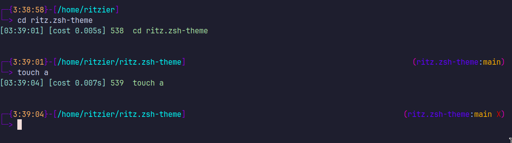

# ritz.zsh-theme



A customize ZSH theme

## Installation:

Download and copy theme to .oh-my-zsh

```
git clone https://github.com/ritzier/ritz.zsh-theme
cd ritz.zsh-theme
cp ritz.zsh-theme $HOME/.oh-my-zsh/themes/
```

Modified `$HOME/.zshrc`:

```bash
ZSH_THEME="ritz"
```
